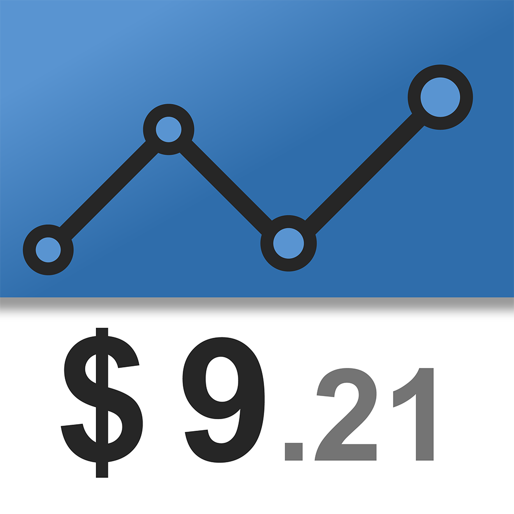

# Expense 💳

<p align="center">
  <a align="center" href="https://testflight.apple.com/join/Ea4FgKEF">
  
  <a align="center" href="https://testflight.apple.com/join/Ea4FgKEF">
  
  </a>
</p>

<p align="center">
  <strong>Un gestor de gastos para iOS ligero, privado y bellamente simple.</strong><br>
  100% sin conexión · Cero rastreo · Registro instantáneo · Automatización fluida con Apple Pay
</p>

<p align="center">
  <a href="https://swift.org"></a>
  <a href="https://developer.apple.com/ios/"></a>
  <a href="https://github.com/WinchellWang/expense/releases"></a>
  <a href="../LICENSE"></a>
</p>

<p align="center">
  <a href="../README.md">English</a> •
  <a href="README.zh-Hans.md">简体中文</a> •
  <a href="README.zh-Hant.md">繁體中文</a> •
  <a href="README.ja.md">日本語</a> •
  <a href="README.fr.md">Français</a> •
  <a href="README.es.md"><b>Español</b></a>
</p>

---

## ✨ ¿Por qué Expense?

Hoy en día, la mayoría de las aplicaciones de finanzas personales están repletas de muros de pago, suscripciones caras, feeds sociales, publicidad financiera invasiva y rastreo de datos privados en segundo plano.

**Expense** vuelve a lo fundamental: un registro de gastos elegante, ágil y libre de distracciones que respeta tu tiempo y tu privacidad. Con un peso de **tan solo unos pocos megabytes (< 5 MB)**, Expense es una herramienta nativa fiel a la filosofía "pequeña y hermosa", diseñada meticulosamente en Swift y SwiftUI.

---

## 🌟 Características Destacadas

### ⚡ Flujo de registro ágil e intuitivo
- **Añadir en un toque**: Abre la app, introduce el importe en su teclado táctil personalizado, pulsa un icono de categoría y listo. Sin pantallas intermedias de confirmación.
- **Modos de entrada adaptables**: Permite alternar entre el modo decimal estándar y el modo de dos decimales fijos para una máxima velocidad al registrar.
- **Ordenación inteligente por uso**: Los iconos de categorías se ordenan automáticamente según la frecuencia con la que los usas, situando tus favoritos siempre a mano.

### 🎨 Categorías totalmente personalizables
- Diseña una estructura de categorías que se adapte exactamente a tu estilo de vida.
- Elige cualquier nombre y selecciona entre cientos de emojis nativos de Apple organizados por temas.
- Reordena, renombra o elimina categorías en cualquier momento. Modificar un nombre actualiza en cascada todos los registros históricos automáticamente.

### 🍏 Registro automático y fluido con Apple Pay
- Convierte cada pago en un apunte contable al instante sin mover un dedo.
- Integrado con las tecnologías nativas de iOS **App Intents** y **Atajos de Siri**.
- Cada vez que pagas con Apple Pay, una automatización personal se ejecuta silenciosamente en segundo plano registrando el comercio, el importe y la fecha, sin necesidad de abrir la aplicación.
- Consulta la [Guía de configuración de automatización](AUTOMATION_GUIDE.es.md).

### 🔒 Privacidad total y funcionamiento 100% local
- **Cero rastreo**: Sin SDKs de terceros, sin anuncios publicitarios, sin analíticas de comportamiento, sin necesidad de registrar cuentas y sin servidores remotos.
- **Almacenamiento local seguro**: Todos tus datos financieros residen exclusivamente en el entorno aislado (sandbox) de tu iPhone.

### ☁️ Control absoluto de tus datos: Respaldo en iCloud y exportación
- **Tus datos te pertenecen únicamente a ti**.
- **Copia de seguridad en iCloud**: Guarda tus datos en tu espacio privado de iCloud con respaldo automático diario en segundo plano.
- **Exportación en un solo toque**: Exporta hojas de cálculo en formato **CSV** (compatible con Excel y Numbers) o copias completas en **JSON** legible en cualquier momento.
- **Restauración inteligente**: Restaura copias de seguridad desde la app Archivos o iCloud con deduplicación inteligente y fusión automática de categorías.

### 🪶 Ultraligera (Verdaderamente "pequeña y hermosa")
- Desarrollada 100% en SwiftUI nativo, libre de dependencias pesadas de terceros.
- El paquete ocupa **menos de 5 MB**, optimizando el almacenamiento y permitiendo un arranque instantáneo.

---

## 🚀 Compilación y Ejecución

### Requisitos previos
- macOS 15.0+ (Sequoia) con Xcode 27.0+ instalado
- Dispositivo o simulador con iOS 18.0+

### Instrucciones
1. Clona el repositorio:
   ```bash
   git clone https://github.com/WinchellWang/expense.git
   cd expense
   ```
2. Abre el proyecto en Xcode:
   ```bash
   open Expense.xcodeproj
   ```
3. Selecciona tu dispositivo o simulador y pulsa `Cmd + R` para compilar y ejecutar.

---

## 🤖 Guía de automatización con Apple Pay

Expense admite acciones nativas en Atajos de iOS:

1. Abre la app **Atajos** en tu iPhone.
2. Ve a la pestaña **Automatización** y crea una **Nueva automatización personal**.
3. Selecciona **Transacción** (Apple Pay) como activador.
4. Añade la acción de Expense **«Añadir gasto»**, vinculando el importe y el comercio.
5. Selecciona **Ejecutar inmediatamente** sin confirmación previa.

Para obtener instrucciones paso a paso detalladas, consulta la [Guía de automatización](AUTOMATION_GUIDE.es.md).

---

## 🌐 Idiomas Compatibles

Expense se adapta de forma nativa al idioma configurado en tu dispositivo:

- 🇺🇸 **English** (Inglés)
- 🇨🇳 **简体中文** (Chino simplificado)
- 🇭🇰 / 🇹🇼 **繁體中文** (Chino tradicional)
- 🇯🇵 **日本語** (Japonés)
- 🇫🇷 **Français** (Francés)
- 🇪🇸 **Español**

---

## 📄 Licencia

Este proyecto está bajo la Licencia GNU General Public License v3.0 (GPL v3). Consulta el archivo [LICENSE](../LICENSE) para más detalles.
